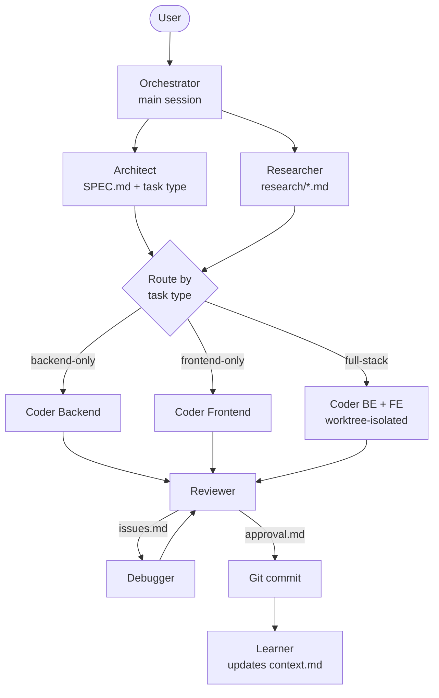
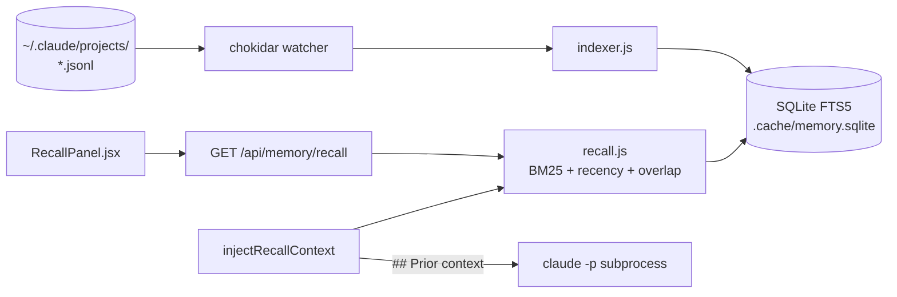

# Agent Coding — URI Platform Workspace

A multi-agent orchestrator for Claude Code. Spin up a task, the workspace runs Architect, Researcher, Coders, Reviewer, Debugger and Learner against it — sequentially as sub-agents, or in parallel as a coordinated team — and ships verified code into the target repo. A React + Vite + Express UI sits on top of the same orchestrator and exposes Chat, Investigate, Trading, Monitor, Usage and admin pages for the underlying `claude -p` subprocesses.

## What this is

- An automated pipeline that spawns `claude -p` subprocesses per stage (Architect → Researcher → Coder → Reviewer → Debugger → Learner) and routes their outputs as files under `tasks/[project]/[task-id]/`.
- A roster of 15 agents, each with its own "soul" and model — defined in `.claude/agents/*.md`, surfaced through the orchestrator.
- A React + Vite + Express UI in `ui/` that drives the same orchestrator from the browser and persists chats, queues, agents, skills, MCP configs, and per-project memory.
- A cross-session memory recall layer that indexes every `~/.claude/projects/**/*.jsonl` transcript on the host and auto-injects relevant prior turns into newly spawned sessions.

## Workflow at a glance



**What this shows:** the orchestrator runs Architect and Researcher in parallel, then routes implementation work by the task type the Architect labeled in `SPEC.md`. Full-stack work spawns Backend and Frontend coders in isolated git worktrees so they never collide. Reviewer is the only gate — it either approves and lets the orchestrator commit, or hands back `issues.md` to the Debugger. Learner runs after approval and folds non-obvious findings into `projects/[project]/context.md`.

## Agents

| Agent           | Soul                                                     | Model  | Role                                                              |
| --------------- | -------------------------------------------------------- | ------ | ----------------------------------------------------------------- |
| Architect       | "Designing systems is my passion"                        | opus   | Analyze requirements, write `SPEC.md`, label task type            |
| Researcher      | "Knowledge is power"                                     | opus   | Pull docs, libraries, best-practice notes into `research/`        |
| Coder Backend   | "Clean, efficient code is art"                           | opus   | Implement API, database, services per SPEC backend section        |
| Coder Frontend  | "Beautiful UI is a conversation between design and code" | opus   | Implement UI per SPEC frontend section, verify via browser MCP    |
| Reviewer        | "Code quality is non-negotiable"                         | opus   | Approve or write `issues.md` against the SPEC                     |
| Debugger        | "Bugs fear me"                                           | opus   | Resolve every entry in `issues.md`, write `fix-log.md`            |
| Investigator    | "Every bug has a birth certificate — I find it"          | opus   | Interactive root-cause investigation, on-demand                   |
| Documenter      | "Clarity comes from showing, not just telling"           | opus   | Write docs and Mermaid diagrams from SPEC and code                |
| Learner         | "Every task is a lesson"                                 | opus   | Extract reusable conventions into `projects/[project]/context.md` |
| QC              | —                                                        | opus   | Diff-aware test runs, coverage gap analysis, flaky-test isolation |
| DevOps          | —                                                        | opus   | Kubernetes manifests, Helm, ArgoCD, GitHub Actions                |
| Brainstorm      | —                                                        | opus   | CTO-style devil's advocate — surfaces approaches and tradeoffs    |
| Finance         | —                                                        | opus   | Market analysis via the TradingView MCP                           |
| Room Designer   | —                                                        | opus   | Generate room/team rosters from a free-form description           |
| Prompt Enhancer | —                                                        | opus   | Rewrite vague task descriptions into actionable agent prompts     |

Agents do not talk to each other directly in `/workflow`. The orchestrator reads each agent's output file and feeds it into the next agent's prompt.

## Sub-agents vs Agent Teams

`/workflow` uses **sub-agents**: each stage is spawned via the `Agent()` tool, runs in its own context window, and reports a result back to the main session. Stages are sequenced by the orchestrator (parallel where safe — Architect/Researcher, BE/FE coders in worktrees), and shared state lives on disk under `tasks/[project]/[task-id]/`. Pick this when the task is well-defined and you mostly need the result of each stage.

`/team-workflow` uses **Agent Teams** (experimental): the lead session creates a team, spawns multiple Claude Code sessions as teammates, and lets them message each other directly with `SendMessage`. The Architect lays out lanes in `team-board.md`, then Frontend, Backend, DevOps and (optionally) Documenter execute in parallel and negotiate contracts inline. Reviewer gates at the end. Pick this when a task crosses team boundaries — FE + BE contracts, service + k8s manifest — and the teammates need to converge on a contract while implementing.

Agent Teams require `CLAUDE_CODE_EXPERIMENTAL_AGENT_TEAMS=1` in `.claude/settings.json` and an interactive `claude` session.

## Commands

`/create-task` — scaffold a `tasks/[project]/[task-id]/` directory with `input.md` and `target-info.md`.

```bash
/create-task "Write API for user service" --target /path/to/repo
```

`/workflow` — run the full sequential pipeline against an existing task (or create one inline with `--new`).

```bash
/workflow tasks/myproj/20260421-143300-write-api-user-service
/workflow --new "Add login API" --target /path/to/repo
```

`/team-workflow` — same intent as `/workflow` but with parallel teammates that `SendMessage` each other.

```bash
/team-workflow --new "Cross-layer feature — FE + BE + k8s" --target /path/to/repo
/team-workflow [task-id] --teams frontend,backend
```

`/investigate` — interactive root-cause investigation for a bug you describe, not part of the automated pipeline.

```bash
/investigate "login button does nothing on mobile Safari" --target ~/projects/myapp
```

`/queue` — add multiple tasks, then process them sequentially.

```bash
/queue add "Build login API" --target /path/to/repo
/queue start
/queue list
```

`/check-status` — inspect task progress and outputs.

```bash
/check-status 20260422-143000-build-login-api
/check-status --list
```

## UI

`ui/` is a Vite + React frontend with an Express backend (`ui/server.js`). The server orchestrates `claude -p` subprocesses, serves the React app, persists chats and queues, and exposes the recall API. `npm run dev` boots both processes via `concurrently` and the app lives at `http://localhost:5173`.

- **Chat** — multi-thread conversations with any agent, with sidebar threads and per-team filtering
- **Investigate** — interactive root-cause investigation backed by the Investigator agent
- **Trading** — finance chat backed by the TradingView MCP
- **Monitor** — abtop session monitor, parsed and rendered as session cards
- **Usage** — token + cost breakdowns from `usage.jsonl`, including the daily-cost chart
- **Commands** — list and edit slash commands under `.claude/commands/`
- **Agents** — list and edit agent souls under `.claude/agents/`
- **Skills** — list and edit skills under `.claude/skills/`
- **MCP** — manage `.mcp.json` entries and the per-project MCP catalog
- **Companies / Rooms** — edit `companies.json`, roster Rooms and Teams, run the Room Designer
- **Repositories** — register external repos and their per-project MCP configs
- **Tasks / Queue** — browse `tasks/` and drive `queue.json`
- **Memory recall panel** — a sidebar in Chat and Investigate that shows prior turns matching the current prompt

## Cross-session memory recall

Every Claude Code session you have ever run on this host wrote a JSONL transcript to `~/.claude/projects/`. A local SQLite + FTS5 index watches those files, scores them with BM25 + recency + file-overlap, and surfaces them two ways — manually through `GET /api/memory/recall` (the React `RecallPanel`), and automatically by prepending a `## Prior context` block to every `claude -p` subprocess the server spawns.



**What this shows:** the JSONL transcripts are the single source of truth — the indexer parses them through a debounced chokidar watcher and writes turns into SQLite with a contentless FTS5 mirror. Both consumers share one scorer in `recall.js`: the manual path returns scored hits to the React panel, while the auto-inject path is invoked synchronously right before every spawn and is hard-bounded by an 80ms `Promise.race` timeout so a slow query never blocks the spawn. Opt-out is per-project via `memory_recall: false` in `projects/<name>/context.md`.

## Repo layout

```text
agent-coding/
├── CLAUDE.md                  # workspace source-of-truth (loaded each session)
├── companies.json             # rooms / teams config (gitignored)
├── queue.json                 # task queue state
├── .claude/
│   ├── agents/                # 15 agent souls
│   ├── commands/              # slash commands
│   └── skills/                # reusable skills (orchestrator, code-write, …)
├── projects/[project]/
│   └── context.md             # per-project conventions + opt-out flags
├── tasks/[project]/[task-id]/
│   ├── input.md               # original ask + project context
│   ├── target-info.md         # target repo info
│   ├── SPEC.md                # Architect output
│   ├── team-board.md          # contracts (team-workflow only)
│   ├── research/              # Researcher output
│   ├── review/                # backend / frontend / qc / approval / issues / fix-log
│   ├── docs/                  # Documenter output
│   └── commit.md              # final commit hash
└── ui/
    ├── server.js              # Express app + claude -p orchestration
    ├── server/memory/         # SQLite FTS5 indexer + recall + inject
    └── src/                   # Chat / Investigate / Monitor / Usage / Trading / …
```

## Install and run

```bash
cd ui
npm install
npm run dev
# open http://localhost:5173
```

`npm run dev` starts `node server.js` and `vite` together via `concurrently`. The Express server listens on the port logged at startup; Vite proxies `/api` to it.

## Tests

```bash
cd ui
npm test                # node --test against __tests__/memory.*.test.js
npm run test:coverage   # c8 with 80% line + function threshold on memory modules
```

The current memory-recall test suite covers `indexer`, `scoring`, the `/api/memory/recall` route, and the `injectRecallContext` helper.

## Status

Experimental, single-user, host-local. The workspace assumes one developer running everything on their own machine — `~/.claude/projects/` is read directly, the SQLite cache lives at `.cache/memory.sqlite`, and there is no cloud sync. Agent Teams are gated behind `CLAUDE_CODE_EXPERIMENTAL_AGENT_TEAMS=1` in `.claude/settings.json` and require an interactive terminal session (the web UI uses sub-agents).
