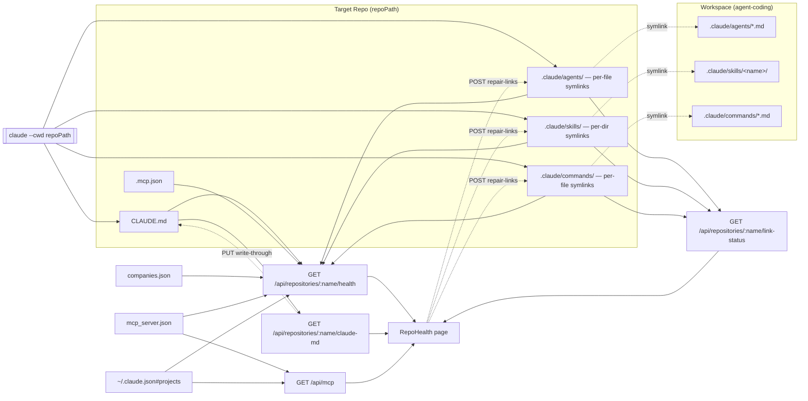
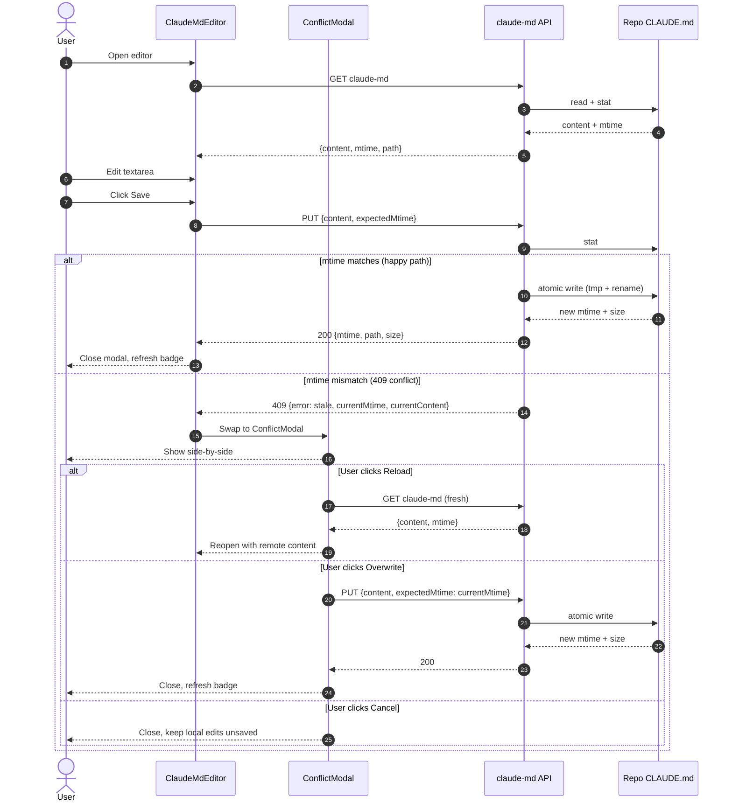

# Workspace Control Panel

tldr — The URI workspace is a **window into per-repo Claude state**, not a controller of it. It mirrors what each repo already has (CLAUDE.md, agents, hooks, settings, MCP) read-only, with two narrow write-through exceptions: `CLAUDE.md` (Tier 1) and `.mcp.json` (already shipped). All other per-repo state is view-only.

> **When to read this:** you are building, reviewing, or onboarding to the `/repos` page, `/mcp` page, or any workspace surface that touches another repo's `.claude/` directory.
>
> **When NOT to read this:** for changes scoped to the workspace's own `.claude/` (agents, skills, commands) — those are governed by `CLAUDE.md` at the workspace root.

---

## 1. What this is

The workspace surfaces per-repo Claude Code state from the repos listed in `companies.json` / `mcp_server.json#repositories`. It does **not** own that state — every repo's `.claude/` directory is sovereign and may be edited by the repo owner, the Claude CLI, or any IDE without coordinating with the workspace.

The reframe (locked by Brainstorm §1): **workspace is pull-first**. It reads, displays, and surfaces gaps. It writes only where central editing pays for itself.

### The two write-through exceptions

| File        | Why workspace may write                                                                                                                                                                                                                                           |
| ----------- | ----------------------------------------------------------------------------------------------------------------------------------------------------------------------------------------------------------------------------------------------------------------- |
| `CLAUDE.md` | Single source-of-truth file per repo. Workspace already knows the repo list, so "edit CLAUDE.md for repo X" is one click instead of five. Low race-condition risk (CLI rarely touches it). mtime-checked write with 409 conflict modal mitigates concurrent edit. |
| `.mcp.json` | Shipped previously via `/mcp` page. Same MCP catalog reused across repos; central editing avoids round-tripping through each repo's config.                                                                                                                       |

Everything else — `.claude/settings.json`, `.claude/agents/*.md`, `.claude/skills/`, `~/.claude.json` — is **view-only** at Tier 1. See [Coverage matrix](#2-coverage-matrix) for the full breakdown and rationale.

See `tasks/agent-coding/20260515-uri-central-control/research/brainstorm.md` §1 for the original framing.

---

## 2. Coverage matrix

| Artifact                                         | Mode                           | Stored at                                                         | Owner                                         |
| ------------------------------------------------ | ------------------------------ | ----------------------------------------------------------------- | --------------------------------------------- |
| Repo's `CLAUDE.md`                               | **edit**                       | `<repoPath>/CLAUDE.md`                                            | repo owner + workspace (write-through)        |
| Repo's `.mcp.json`                               | **edit**                       | `<repoPath>/.mcp.json`                                            | repo owner + workspace (`/mcp` page)          |
| Workspace MCP catalog                            | **orchestrate**                | `mcp_server.json` (workspace root)                                | workspace                                     |
| Repo registry                                    | **orchestrate**                | `companies.json`, `mcp_server.json#repositories[]`                | workspace                                     |
| Repo's `.claude/settings.json`                   | view-only                      | `<repoPath>/.claude/settings.json`                                | repo owner / CLI                              |
| Repo's `.claude/settings.local.json`             | view-only                      | `<repoPath>/.claude/settings.local.json`                          | repo owner / CLI                              |
| Repo's hooks (`settings.json#hooks`)             | view-only (badge only)         | `<repoPath>/.claude/settings.json`                                | repo owner                                    |
| Repo's permissions (`settings.json#permissions`) | view-only (badge only)         | `<repoPath>/.claude/settings.json`                                | CLI (auto-append on approval)                 |
| Repo's agents                                    | **symlinked + override**       | `<repoPath>/.claude/agents/*.md` (per-file symlink → workspace)   | workspace (link mgmt) + repo owner (override) |
| Repo's commands                                  | **symlinked + override**       | `<repoPath>/.claude/commands/*.md` (per-file symlink → workspace) | workspace (link mgmt) + repo owner (override) |
| Repo's skills                                    | **symlinked + override**       | `<repoPath>/.claude/skills/<name>/` (per-dir symlink → workspace) | workspace (link mgmt) + repo owner (override) |
| Per-repo MCP enabled/disabled state              | view-only (mirror)             | `~/.claude.json#projects[absPath]`                                | Claude CLI                                    |
| claude.ai connectors                             | out of scope                   | n/a (cloud-side)                                                  | Anthropic                                     |
| Workspace agents/skills/commands                 | **source-of-truth (own repo)** | `agent-coding/.claude/`                                           | workspace                                     |

**Mode legend:**

- **view** — workspace renders, never writes
- **edit** — workspace renders and may write back via API
- **orchestrate** — workspace is the canonical source
- **symlinked + override** — entries are per-file (or per-dir for skills) symlinks pointing back to workspace source-of-truth; repo owner may drop a real file/dir with the same name to override one specific entry (filename match wins). See [§8](#8-per-repo-agent-override-workflow).
- **source-of-truth** — workspace owns the master copy; repos consume via symlinks created by `linkRepo()` and the migration script.

See `tasks/agent-coding/20260515-uri-central-control/research/brainstorm.md` §1 for the per-row reasoning.

---

## 3. Data flow



**What this shows.** Two flows now share the page. **Top half (CLI runtime):** when `/workflow` (and 5 sibling spawn sites) start `claude`, they pass `cwd: repoPath`. The CLI loads `CLAUDE.md` natively from the target repo and resolves `.claude/{agents,skills,commands}/X` filename-by-filename — each entry is either a real override file in the target repo or a symlink that transparently resolves to the workspace's source-of-truth. **Bottom half (Repo Health UI):** `GET /health` adds a new `links` field summarising symlink integrity, `GET /link-status` returns the detailed inventory (valid / missing / broken / overrides), and `POST /repair-links` is the only write-back path for symlinks (overrides are never touched). `CLAUDE.md` write-through is unchanged.

---

## 4. CLAUDE.md save flow



**What this shows.** The editor uses optimistic concurrency: every save sends the mtime read at GET time. If the file changed between GET and PUT (CLI edit, manual edit, another tab), the server responds 409 with the **current content inline** — no second round-trip needed to render the conflict view. The user resolves by reloading (discard local edits), overwriting (force-win), or cancelling (keep editing locally).

---

## 5. Endpoint reference

All endpoints live in `ui/server.js`. Line numbers are placeholders until the Backend lane lands — Documenter to update once `review/backend-summary.md` reports finalized line numbers.

| Method | Path                                | Statuses           | Response shape                                                          | Source                  |
| ------ | ----------------------------------- | ------------------ | ----------------------------------------------------------------------- | ----------------------- |
| GET    | `/api/repositories/:name/health`    | 200, 404, 500      | `HealthResponse` (see below)                                            | `ui/server.js` (BE TBD) |
| GET    | `/api/repositories/:name/claude-md` | 200, 404, 500      | `{ content, mtime, path }` / `{ error, path }`                          | `ui/server.js` (BE TBD) |
| PUT    | `/api/repositories/:name/claude-md` | 200, 400, 409, 500 | `{ mtime, path, size }` / 409 `{ error, currentMtime, currentContent }` | `ui/server.js` (BE TBD) |

`:name` is the workspace-assigned repo name from `mcp_server.json#repositories[].name`. Not an absolute path. Not base64.

### `HealthResponse` shape (locked)

Full TypeScript shape lives in [SPEC.md §2](../tasks/agent-coding/20260515-uri-central-control/SPEC.md). Key fields:

- `name`, `repoPath`, `company`, `exists`, `lastScannedAt`
- `claudeMd: { exists, mtime, size }`
- `settings: { exists, localExists, hookCount, permissionAllowCount, permissionDenyCount, additionalDirectoriesCount }`
- `agents: { count, names[] }`
- `skills: { count, names[] }`
- `mcp: { dotMcpJsonExists, dotMcpJsonServerCount, workspaceManagedServerCount, enabledMcpServers[], disabledMcpServers[], enabledMcpjsonServers[], disabledMcpjsonServers[] }`

### Error semantics

- **404** on `:name` not found in `companies.json` / `mcp_server.json`.
- **404** on `GET claude-md` when file is absent; UI offers "Create CLAUDE.md" (PUT with `expectedMtime: null`).
- **409** on `PUT claude-md` mtime mismatch — body includes fresh `currentContent` so the conflict modal renders without an extra GET.
- **400** on `PUT claude-md` when `content` is not a string.
- **500** on any unexpected fs error; original message included.

<!-- gap: BE line numbers not yet finalized — Documenter will SendMessage Backend near end of task to backfill -->

---

## 6. Caching

A server-side in-memory cache (`Map<name, {at, payload}>` in `ui/server.js`) holds `HealthResponse` payloads with a **30-second TTL**. The cache is keyed by `:name` (the repo name from `mcp_server.json`). The TTL exists because `~/.claude.json` mutates roughly every tool use (sub-second) — any longer TTL ships stale "last scanned" data, any shorter hammers the file for no benefit. The cache is invalidated for a single `:name` entry only when `PUT /api/repositories/:name/claude-md` succeeds; other entries are unaffected. The client adds no second cache layer — each `<RepoHealthCard>` fetches its own health on mount, with cheap re-mounts thanks to the server TTL. The `GET claude-md` endpoint is uncached (the file may change externally and the user needs the freshest mtime for the next PUT).

---

## 7. Out of scope (deferred)

The following items are deliberately deferred. Future PRs touching this surface should respect these boundaries unless explicitly re-scoped.

- **Hooks editor** — cut per Brainstorm §3(a). Surface `hookCount` badge only.
- **Permissions editor** — defer to Tier 2 only when allowlist editing becomes real friction.
- **Multi-machine sync** — single user, single machine.
- **File watcher** for `~/.claude.json` — 30s TTL cache is enough.
- **Writing to `.claude/settings.json`** from workspace — repo owner only (constraint).
- **Repo identity refactor** (git remote URL) — Tier 3, deferred.
- **Diff/merge UI** for CLAUDE.md — replaced by simple side-by-side conflict modal.
- **Auto-discovery** of repos by filesystem scan — `companies.json` is sole source.
- **Markdown preview** in editor — defer to Tier 2 if requested.
- **"Apply workspace agents to repo" push** — Option C rejected by Brainstorm.
- **Windows / junction-point support** — macOS-first; ship Unix symlinks only (per-repo agent resolution SPEC §7).
- **Auto-repair on workspace move** — detecting a workspace move requires a filesystem watcher; manual "Repair links" button only.
- **Tier 3 per-repo `.mcp.json`** — per-repo MCP already handled by the `/mcp` page + `projects/<name>/mcp.json` injection at spawn time; per-repo `.mcp.json` overrides remain out of scope.

(Copied verbatim from [SPEC.md §8](../tasks/agent-coding/20260515-uri-central-control/SPEC.md) plus the per-repo agent resolution SPEC §7.)

---

## 8. Per-repo agent override workflow

Default state for every registered repo is **fully symlinked** — `.claude/agents/*.md`, `.claude/commands/*.md`, and `.claude/skills/<name>/` all point back to the workspace source-of-truth. When the Claude CLI spawns with `cwd: repoPath`, it sees the same agents/skills/commands the workspace ships, transparently.

**Override semantics — filename match wins.** Replacing one specific entry with a repo-local real file/dir shadows that entry while every other symlink continues to resolve to the workspace.

### Override an agent for one repo

```bash
cd <repoPath>
rm .claude/agents/coder-frontend.md      # remove the symlink (not the workspace file)
$EDITOR .claude/agents/coder-frontend.md  # create + edit a real file in its place
```

Verify with `ls -la .claude/agents/coder-frontend.md` — mode `-rw-r--r--` (real file) instead of `lrwxr-xr-x` (symlink).

### Commit the override

`.gitignore` catches `/.claude/agents/`, `/.claude/skills/`, `/.claude/commands/` as whole directories, so committing one override requires the `-f` flag:

```bash
git add -f .claude/agents/coder-frontend.md
git commit -m "agents: per-repo override for coder-frontend"
```

This is intentional — `-f` is the "I really mean to commit this" gesture, preventing accidental commits of the entire symlink farm.

### Revert an override (restore the symlink)

Two equivalent paths:

```bash
# Option 1 — UI: open Repo Health → click "Repair links" on the affected repo
# (calls POST /api/repositories/:name/repair-links)

# Option 2 — terminal:
rm <repoPath>/.claude/agents/coder-frontend.md
node /Users/tue.nc/Desktop/agent-coding/scripts/migrate-repo-links.js
```

Either route is idempotent. Existing symlinks and other overrides are untouched; only the missing entry is refilled.

### Caveat: pre-existing real files silently win

If a target repo already had a real `.md` (or skill directory) sitting under `.claude/agents/`, `.claude/commands/`, or `.claude/skills/` **before** `linkRepo()` ran on it, that file is treated as an override and left alone — even if it was never intended as one. This is the "stale-real-file" risk called out in [SPEC §8.1](../tasks/agent-coding/20260515-per-repo-agent-resolution/SPEC.md). The migration script (`scripts/migrate-repo-links.js`) prints any such entries in its summary under `overrides preserved:`; review that list after a first-time migration and `rm` anything you didn't intend to override, then re-run the script to fill in the symlink.

---

## 9. Endpoint reference for link management

Two new endpoints, plus a new field on the existing `/health` response.

| Method | Path                                   | Statuses      | Response shape                                                     | Source                  |
| ------ | -------------------------------------- | ------------- | ------------------------------------------------------------------ | ----------------------- |
| GET    | `/api/repositories/:name/link-status`  | 200, 404, 500 | `LinkStatusResponse` (see below)                                   | `ui/server.js` (BE TBD) |
| POST   | `/api/repositories/:name/repair-links` | 200, 404, 5xx | `{ result: LinkStatusResponse, gitignore: { appended, lines[] } }` | `ui/server.js` (BE TBD) |

`POST repair-links` accepts an optional body `{ "includeGitignore": boolean }` (default `true`). Side-effects: rebuilds any missing/broken symlinks via `repairLinks()`; appends `.gitignore` lines if needed; invalidates the `/health` cache for `:name` so the badge updates immediately on the next paint.

### `LinkStatusResponse` shape

```jsonc
{
  "status":    "linked" | "partial" | "unlinked" | "broken",
  "missing":   ["agents/coder-frontend.md", "skills/research", ...],
  "broken":    ["commands/workflow.md", ...],
  "overrides": ["agents/coder-backend.md", ...],
  "valid":     ["agents/architect.md", ...]
}
```

Status precedence: **broken > partial > unlinked > linked**. Any single broken symlink forces `status === "broken"` regardless of other counts.

### `health.links` field (additive on existing `/health`)

```jsonc
{
  /* ...existing health fields... */
  "links": {
    "status":    "linked" | "partial" | "unlinked" | "broken",
    "missing":   [...],
    "broken":    [...],
    "overrides": [...]
  }
}
```

`valid` is intentionally omitted from `health.links` — `<RepoBadges>` doesn't need the full list, only the rollup counts. Consumers needing the full inventory call `link-status` directly.

### Status thresholds

| Status     | Condition                                                          | Badge tone |
| ---------- | ------------------------------------------------------------------ | ---------- |
| `linked`   | `missing.length === 0 && broken.length === 0` (all valid/override) | green      |
| `partial`  | `missing.length > 0 && (valid + overrides).length > 0`             | amber      |
| `unlinked` | nothing exists in `.claude/{agents,skills,commands}/`              | gray       |
| `broken`   | `broken.length > 0` (precedence: wins over all others)             | red        |

`red` is a new tone added to `RepoBadges.jsx`'s `tones` map.

---

## 10. Workspace path move recovery

Symlinks use **relative** paths from the link parent directory to the workspace source (`path.relative(linkParentDir, workspaceSource)`). Trade-off: links survive only when workspace and repos move **together**. Move just `agent-coding/` and every link in every target repo dangles.

### Detection

- **Repo Health page** — `<RepoBadges>` flips the `links` badge to **red / `<N> broken`** for every affected repo on the next refresh (30s TTL or sooner if invalidated).
- **Server startup** — `[link-check] <repoName>: broken` lines on stderr, emitted by the health-check IIFE that runs before `server.listen()` (advisory only, no mutations).

### Recovery

1. Open the affected repo in **Repo Health** (`/repos`).
2. Click **"Repair links"** in the detail pane (right next to **Edit CLAUDE.md**).
3. The button POSTs `/api/repositories/:name/repair-links`. The server unlinks dangling symlinks, re-creates them pointing to the current workspace location, and refreshes `.gitignore` if needed.
4. Badge flips back to **green / `linked`**.

For batch repair across every registered repo, drop to a terminal:

```bash
node /Users/tue.nc/Desktop/agent-coding/scripts/migrate-repo-links.js
```

The script is idempotent — safe to run any number of times; correct symlinks are skipped, wrong-target symlinks are re-pointed, real-file overrides are preserved.
